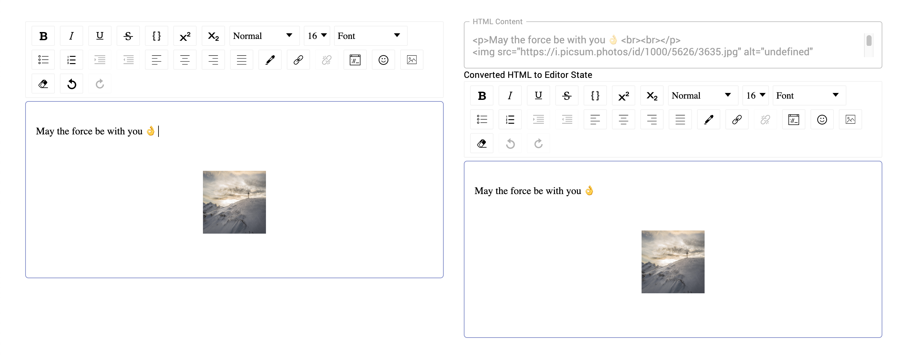

This project was bootstrapped with [Create React App](https://github.com/facebook/create-react-app).

View [Demo](https://davidamunga.github.io/react-editor-demo/) 


## React Editor DraftJS 



[](https://codesandbox.io/s/github/DavidAmunga/react-editor-demo/tree/master/?fontsize=14&hidenavigation=1&theme=dark)

## Overview

This project was created to test React Draft Wysiwyg with hooks.


## Running this project locally

## [Live version](https://book-o-find.netlify.com/)

```
cd react-editor-demo
```

```
yarn install
yarn start
```

## Dependencies


- [React Draft Wysiwyg](https://github.com/jpuri/react-draft-wysiwyg) - Content Editor
- [Material-UI](https://material-ui.com/) - User Interface
- [Prettier](https://github.com/prettier/prettier) - Code Formatter